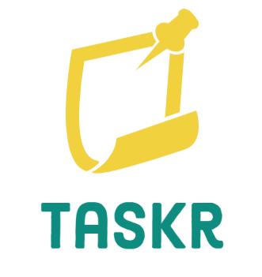

<!-- PROJECT LOGO -->
 

  

  <h3 align="center">Taskr</h3>

  

    A website for you to organize your notes and thoughts in a simple and clean way.
    <!--   -->
    <!-- <a href="docs here :)"><strong>Explore the docs »</strong></a> UNDER DEVELOPMENT -->
     
     
    ·
    <a href="https://github.com/matjsilva/taskr/issues">Report Bug</a>
    ·
    <a href="https://github.com/matjsilva/taskr/issues">Request Feature</a>
  

<!-- TABLE OF CONTENTS -->

  
Table of Contents

  <ol>
    <li>
      <a href="#about-the-project">About The Project</a>
      <ul>
        <li><a href="#built-with">Built With</a></li>
      </ul>
    </li>
    <li>
      <a href="#development-state">Getting Started</a>
    </li>
    <li><a href="#api-usage">Usage</a></li>
    <li><a href="#contact">Roadmap</a></li>
  </ol>

<!-- ABOUT THE PROJECT -->
## About The Project

Taskr was inspired by great website with the same purpose, such as Notion, Evernote and Trello, but Taskr has its own beauty, although it has the same systems as those website mentioned, it also have soemthing special: it's made only by one person.

### Built With

* [Next.js](https://nextjs.org/)
* [React.js](https://reactjs.org/)
* [Flowbite](https://flowbite.com)
* [Firebase](https://https://firebase.google.com)

<!-- DEVELOPMENT STATE -->
## Development State

Taskr is no longer under development, it's now released and complete! :)

<!-- CONTACT -->
## Contact

Matheus Silva "matjs" - [@matjs_](https://twitter.com/matjs_) - matheusjgsilva42@gmail.com
